# Data Anonymization (optional)

## Table of contents 

- [Data Anonymization (optional)](#data-anonymization-optional)
  - [Table of contents](#table-of-contents)
  - [Understand the need for anonymization](#understand-the-need-for-anonymization)
  - [Create a Anonymization View using K-Anonymity](#create-a-anonymization-view-using-k-anonymity)
  - [Preview the anonymized data](#preview-the-anonymized-data)
  - [Use the anonymized view to gain insights](#use-the-anonymized-view-to-gain-insights)
  - [Change the k parameter of the K-Anonymity algorithm](#change-the-k-parameter-of-the-k-anonymity-algorithm)
  - [Create Anonymization View with Differential Privacy](#create-anonymization-view-with-differential-privacy)
  - [Preview the Anonymization View with Differential Privacy](#preview-the-anonymization-view-with-differential-privacy)
  - [Compare aggregation values](#compare-aggregation-values)


## Understand the need for anonymization

1. Start in the Database Explorer and paste the following code into it and run it. Here you can see all the salary data of each employee in detail. Of course, this should not be possible for every user who wants to analyze this data.

```sql
SELECT * FROM "hcx.db.DataIntegration::RT_EMPLOYEES";
```

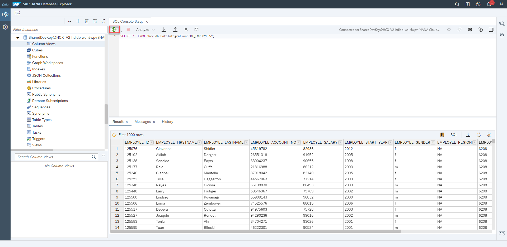

2. A first idea would be to omit the unique identifiers (like ID, first and last name, account id). Paste the following code into it and run it.

```sql
SELECT "EMPLOYEE_SALARY", "EMPLOYEE_START_YEAR", "EMPLOYEE_GENDER", "EMPLOYEE_REGION", "EMPLOYEE_ZIPCODE", "EMPLOYEE_T-LEVEL", "EMPLOYEE_EDUCATION" FROM "hcx.db.DataIntegration::RT_EMPLOYEES";
```

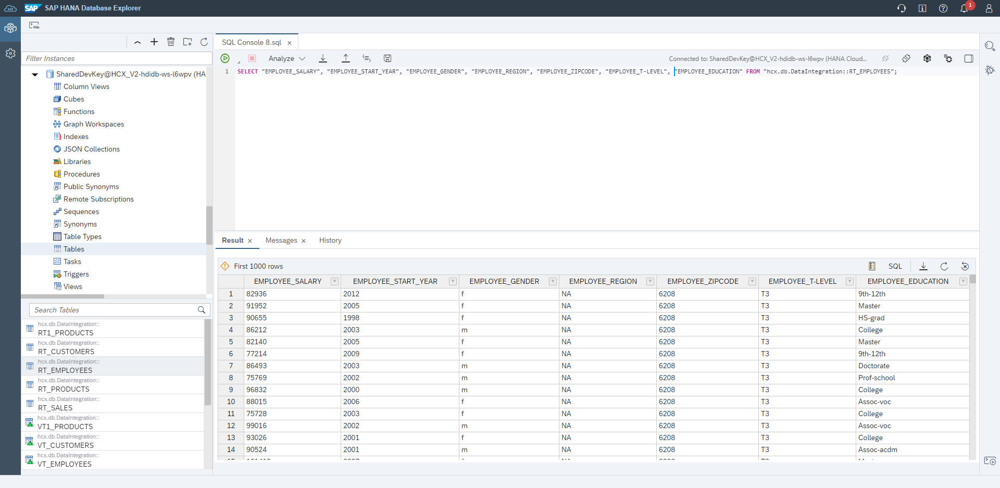

3. But we can now try to identify a single person with the following information that is still in the data. Paste the following code into it and run it.

```sql
SELECT *
FROM "hcx.db.DataIntegration::RT_EMPLOYEES"
WHERE EMPLOYEE_START_YEAR = 2008
	AND EMPLOYEE_GENDER = 'm'
	AND EMPLOYEE_REGION = 'APJ'
	AND EMPLOYEE_ZIPCODE = 7004
	AND "EMPLOYEE_T-LEVEL" = 'T4'
	AND EMPLOYEE_EDUCATION = 'Doctorate';
```

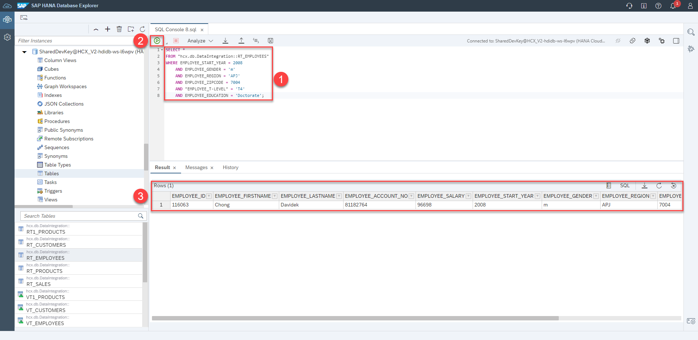

1. As we see in the result, this information only allows the conclusion on a single person. The method of omitting the identifiers does not protect our employees and their salary data. With how many others the problem would also occur we see with the following statement. Paste the following code into it and run it.

```sql
SELECT 
"EMPLOYEE_START_YEAR", "EMPLOYEE_GENDER", "EMPLOYEE_REGION", "EMPLOYEE_ZIPCODE", "EMPLOYEE_T-LEVEL", "EMPLOYEE_EDUCATION", count(*)
FROM "hcx.db.DataIntegration::RT_EMPLOYEES"
GROUP BY "EMPLOYEE_START_YEAR", "EMPLOYEE_GENDER", "EMPLOYEE_REGION", "EMPLOYEE_ZIPCODE", "EMPLOYEE_T-LEVEL", "EMPLOYEE_EDUCATION"
HAVING count(*)=1;
```

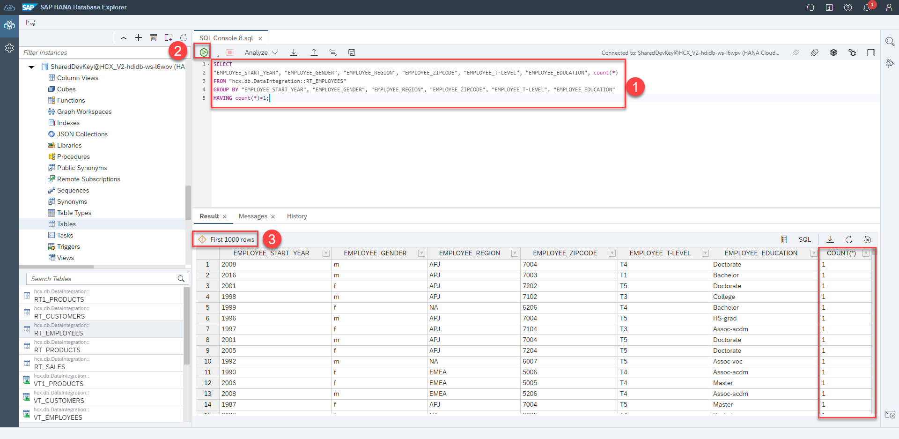

As shown by the outcome, there are numerous distinct combinations of quasi-identifiers, indicated by a Count value of 1, that can result in the revelation of sensitive information, such as salary amounts, of those involved. Therefore, data anonymization is necessary in order to share this sample data securely, without endangering data privacy.

<!-- 
5. To understand the need for anonymization, run the SQL query on the sample data as given below:

```sql
SELECT "EMPLOYEE_START_YEAR", "EMPLOYEE_GENDER", "EMPLOYEE_ZIPCODE", "EMPLOYEE_SALARY", count(*) as "Count" FROM "hcx.db.DataIntegration::RT_EMPLOYEES"
GROUP BY "EMPLOYEE_START_YEAR", "EMPLOYEE_GENDER", "EMPLOYEE_ZIPCODE", "EMPLOYEE_SALARY" ORDER by "Count" ASC;
```


As shown by the outcome, there are numerous distinct combinations of quasi-identifiers, indicated by a Count value of 1, that can result in the revelation of sensitive information, such as salary amounts, of those involved. Therefore, data anonymization is necessary in order to share this sample data securely, without endangering data privacy.

-->

## Create a Anonymization View using K-Anonymity

> Next, to meet the above requirement, you will create an anonymization view using the employee data. The objective of this exercise is to anonymize the salary data with SAP HANA's integrated K-Anonymity Algorithm. Afterwards you will preview the anonymized salary data and gain some insights.

1) 1) Click on **View** in the Menu Bar
   2) Then click on **Command Palette...**


2) Type in `SAP HANA: Create HANA Database Artifact` and select this option


3) 1) Change the path to the **DataAnonymization*** folder, by clicking the folder icon
   2) Click on **..** to navigate to a higher level

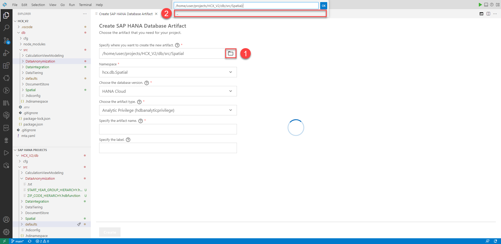

4) Click on **DataAnonymization** and confirm with **OK**

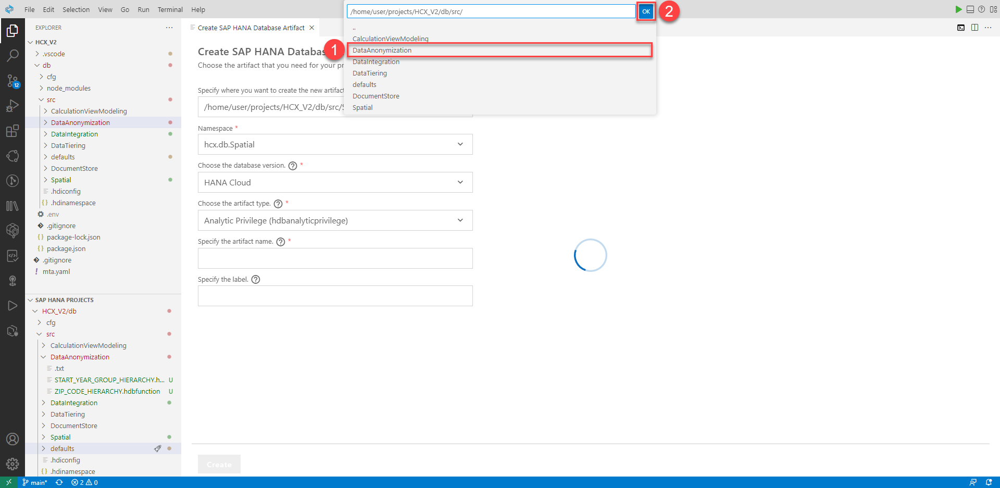

5) Create SAP HANA Database Artifact wizard:
   1) **Path**: `/home/user/projects/HCX_V2/db/src/DataAnonymization`
   2) **Namespace**: `hcx.db.DataIntegration` (should be automatically filled)
   3) **Database Version**: `HANA Cloud`
   4) **Artifact type**: `SQL View (hdbview)`
   5) **Name**: `SALARYANON`
   6) Click **Create**

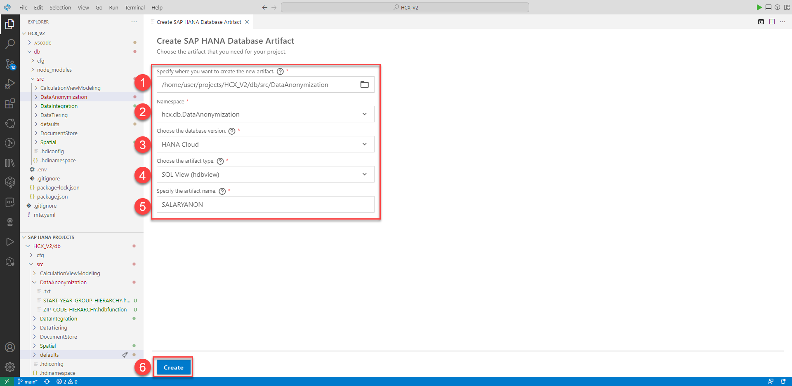

6) Paste the code into the created file to create an anonymized view using K-ANONYMITY and deploy it. The code contains three quasi-identifying columns. These are start year, zip code, gender and of course salary as sensitive data. By deploying the provided code snippet, you anonymize the View of your salary data using the integrated k-anonymity algorithm in HANA Cloud. K in the context defines the smallest possible group with the same quasi-identifiers. 
If an attribute is a quasi-identifier, it will be anonymized using the predefined hierarchies or functions.

```sql
VIEW "hcx.db.DataAnonymization::SALARYANON"
AS SELECT "EMPLOYEE_ID","EMPLOYEE_START_YEAR", "EMPLOYEE_GENDER", "EMPLOYEE_ZIPCODE", "EMPLOYEE_SALARY" FROM "hcx.db.DataIntegration::RT_EMPLOYEES"
WITH ANONYMIZATION (ALGORITHM 'K-ANONYMITY' PARAMETERS '{"k": 8}'
COLUMN "EMPLOYEE_ID" PARAMETERS '{"is_sequence":true}'
COLUMN "EMPLOYEE_GENDER" PARAMETERS '{"is_quasi_identifier":true,"hierarchy":{"embedded":[["f"],["m"]]}}'
COLUMN "EMPLOYEE_ZIPCODE" PARAMETERS '{"is_quasi_identifier":true,"hierarchy":{"function":"hcx.db.DataAnonymization::ZIP_CODE_HIERARCHY", "levels":4}}'
COLUMN "EMPLOYEE_START_YEAR" PARAMETERS '{"is_quasi_identifier":true,"hierarchy":{"function":"hcx.db.DataAnonymization::START_YEAR_GROUP_HIERARCHY", "levels":3}}');
```

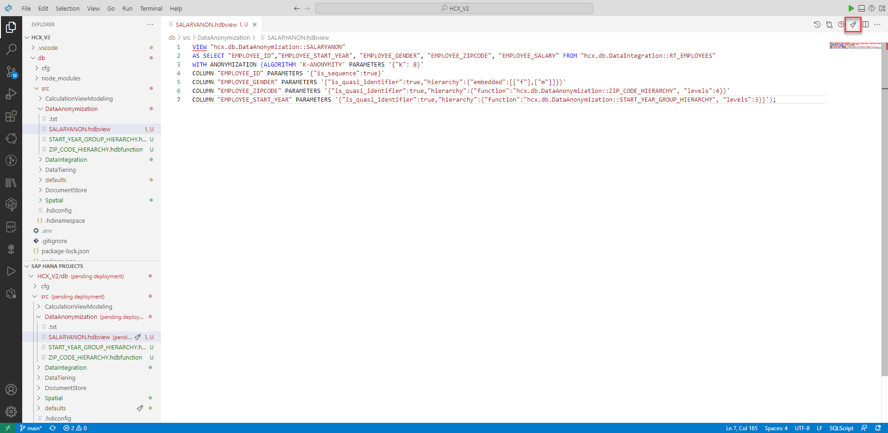

7) Please ignore the red error message above the view. This is not relevant for our use.

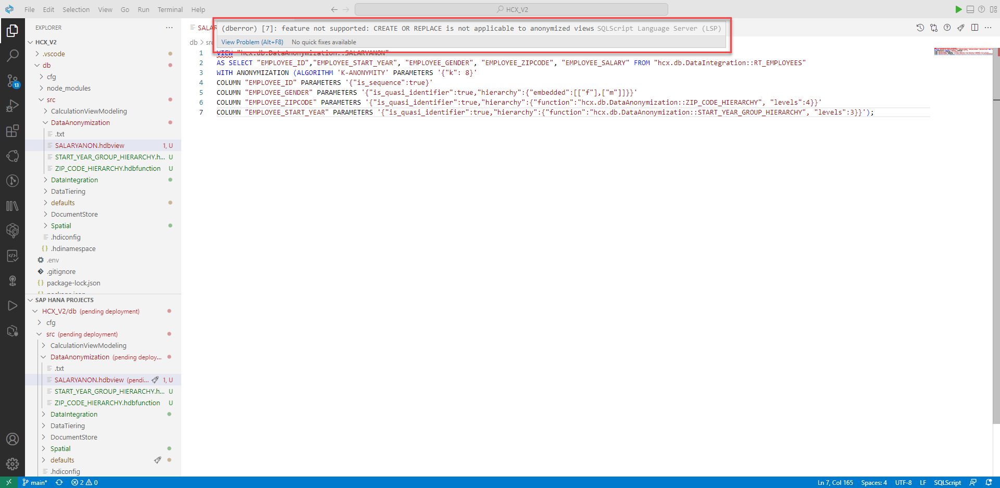

## Preview the anonymized data

1. 1. Switch to the Database Explorer and open your HDI Container. Open a SQL console.
   2. Initially, the anonymization view must be refreshed. Then we can query it. Paste the following statements in the console 
   3. Run the statements by clicking on the green play button

```sql
REFRESH VIEW "hcx.db.DataAnonymization::SALARYANON" ANONYMIZATION;
SELECT *  FROM "hcx.db.DataAnonymization::SALARYANON";
```

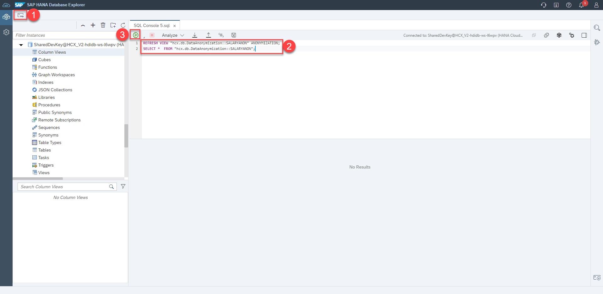

2. As you can see the zip code column is no longer completely visible and the last number has been made unrecognizable with a *.

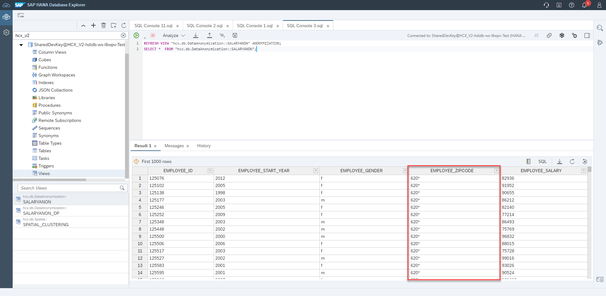

## Use the anonymized view to gain insights

1. To improve the anonymity, we can determine the number of individuals that cannot be differentiated and count the number of distinct combinations by executing the following statement:

```sql
SELECT "EMPLOYEE_START_YEAR", "EMPLOYEE_GENDER", "EMPLOYEE_ZIPCODE", count(*) as "Count", MAX("EMPLOYEE_SALARY") FROM "hcx.db.DataAnonymization::SALARYANON"
GROUP BY "EMPLOYEE_START_YEAR", "EMPLOYEE_GENDER", "EMPLOYEE_ZIPCODE" ORDER by "Count" ASC;
```

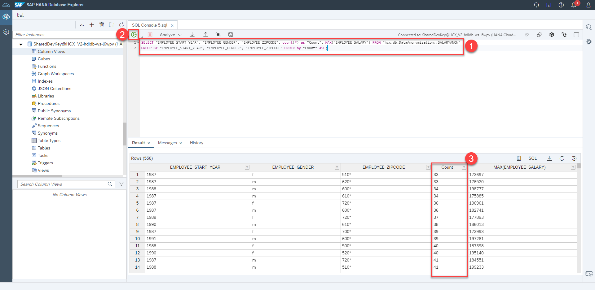

As evidenced, the anonymization process has been successful as there are significantly more individuals in each group than the specified K value of 8. This indicates that additional quasi-identifiers could have been included in the anonymized view while still maintaining accurate results with a high level of privacy.

## Change the k parameter of the K-Anonymity algorithm

1. We can also say that we want to have at least 100 people with the same attributes in each group. For this we switch back to BAS and change the k parameter to **100** and deploy the view again.

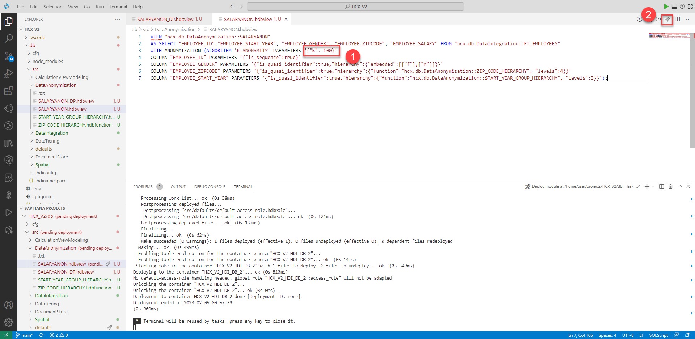

2. If we refresh the view again and select it, we see that this time the start year column is also aggregated to individual year groups.

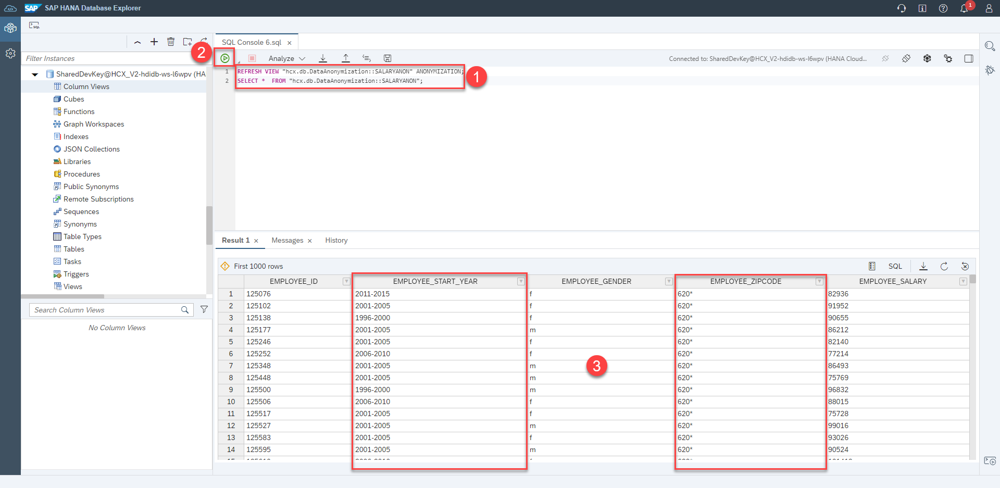

<!-- Change Privilige?! -->

## Create Anonymization View with Differential Privacy

> Differential privacy will add random noise to numerical values based on a mathematical formula that keeps trends of data intact.

1) 1) Click on **View** in the Menu Bar
   2) Then click on **Command Palette...**


2) Type in `SAP HANA: Create HANA Database Artifact` and select this option


3) Create SAP HANA Database Artifact wizard:
   1) **Path**: `/home/user/projects/HCX_V2/db/src/DataAnonymization`
   2) **Namespace**: `hcx.db.DataIntegration` (should be automatically filled)
   3) **Database Version**: `HANA Cloud`
   4) **Artifact type**: `SQL View (hdbview)`
   5) **Name**: `SALARYANON_DP`
   6) Click **Create**

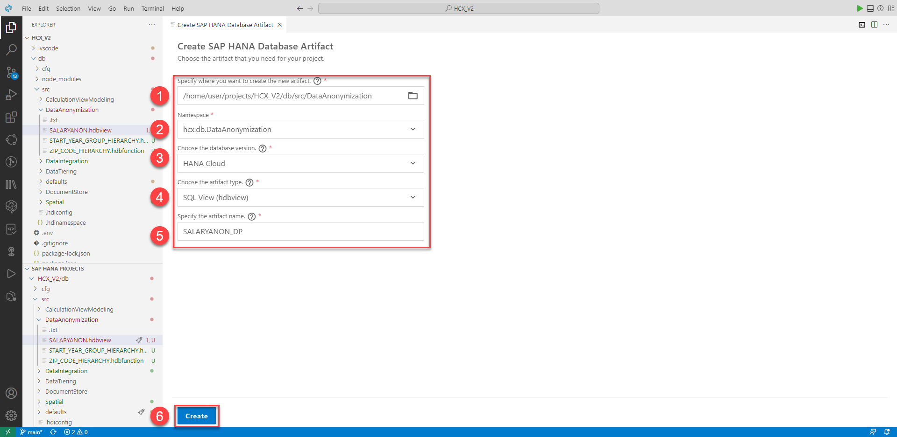

4) Paste the code into the created file to create an anonymized view using Differential Privacy and deploy it

```sql
VIEW "hcx.db.DataAnonymization::SALARYANON_DP"
AS SELECT "EMPLOYEE_ID", "EMPLOYEE_START_YEAR", "EMPLOYEE_SALARY"
FROM "hcx.db.DataIntegration::RT_EMPLOYEES"
WITH ANONYMIZATION (ALGORITHM 'DIFFERENTIAL_PRIVACY' PARAMETERS ''
COLUMN "EMPLOYEE_ID" PARAMETERS '{"is_sequence":true}'
COLUMN "EMPLOYEE_SALARY" PARAMETERS '{"is_sensitive":true, "epsilon" : 0.5, "sensitivity": 100000}');
```

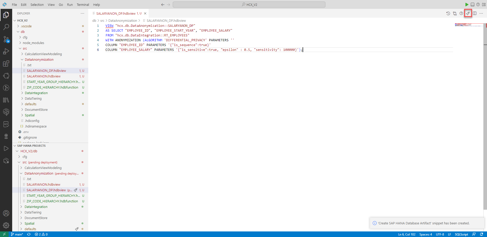

## Preview the Anonymization View with Differential Privacy

1) 1) Initially, the anonymization view must be refreshed. Then we can query it. Paste the following statements in the console 
   2. Run the statements by clicking on the green play button

```sql
REFRESH VIEW "hcx.db.DataAnonymization::SALARYANON_DP" ANONYMIZATION;
SELECT * FROM "hcx.db.DataAnonymization::SALARYANON_DP";
```

As you can see, the salaries for individual employees have changed significantly, and there are some negative entries that don't make much sense. However, this means that the correct salary of each employee is no longer visible.

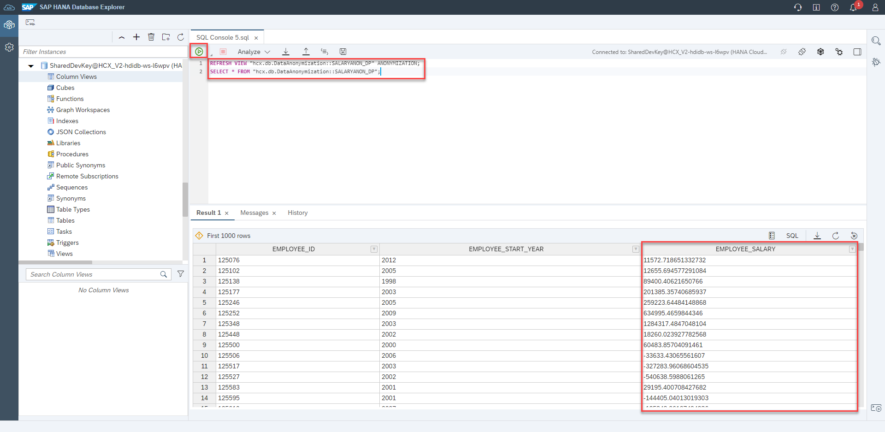

## Compare aggregation values

1. Run the following statements to find out via aggregated queries whether the overall salary trends still match the real data.

```sql
SELECT "EMPLOYEE_START_YEAR", AVG("EMPLOYEE_SALARY") FROM "hcx.db.DataAnonymization::SALARYANON_DP" GROUP BY "EMPLOYEE_START_YEAR"ORDER BY "EMPLOYEE_START_YEAR" ASC;
SELECT "EMPLOYEE_START_YEAR", AVG("EMPLOYEE_SALARY") FROM "hcx.db.DataIntegration::RT_EMPLOYEES" GROUP BY "EMPLOYEE_START_YEAR" ORDER BY "EMPLOYEE_START_YEAR" ASC;
```

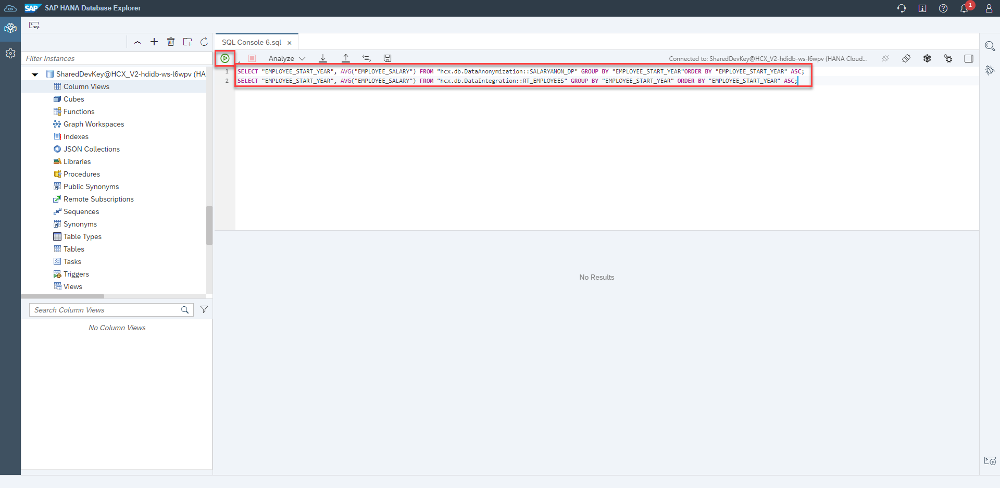

2. If you compare the two queries, you will notice that they do not match, but have similar values.


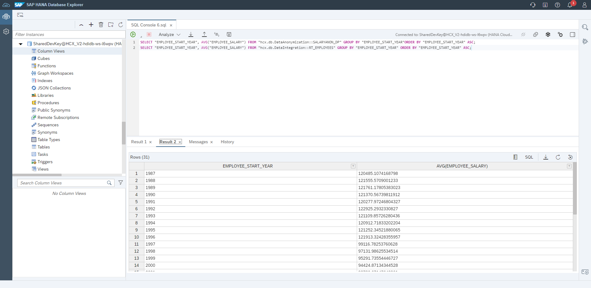


< [Back to Overview](README.md)


