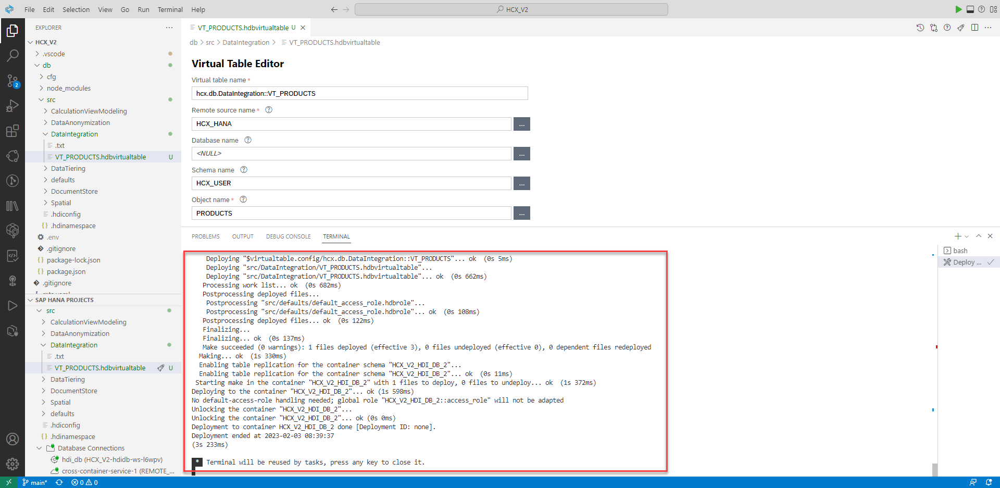
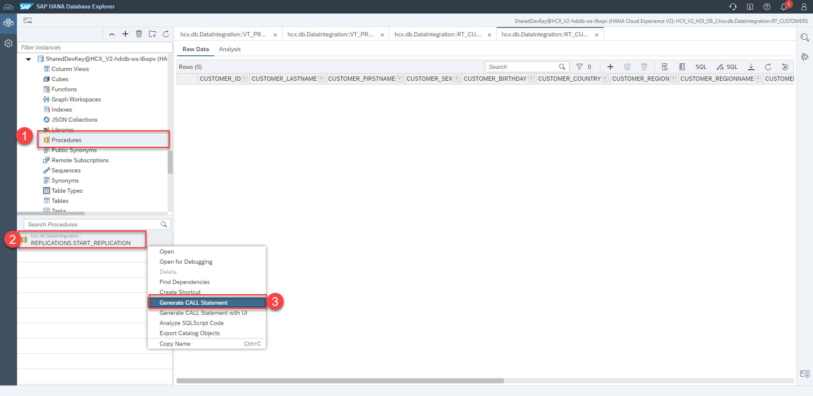

# Data Integration Exercise (Mandatory)

## Table of contents

- [Data Integration Exercise (Mandatory)](#data-integration-exercise-mandatory)
  - [Table of contents](#table-of-contents)
  - [Create Virtual Table (or Strg+Shift+P)](#create-virtual-table-or-strgshiftp)
  - [Open HDI Container in SAP HANA Database Explorer](#open-hdi-container-in-sap-hana-database-explorer)
  - [Access data of virtual table](#access-data-of-virtual-table)
  - [Create Replication Task](#create-replication-task)
  - [Start the Replication Task](#start-the-replication-task)
  - [Compare virtualized and replicated table data](#compare-virtualized-and-replicated-table-data)
  - [Edit the Replication Task](#edit-the-replication-task)
  - [Insert into Products source table](#insert-into-products-source-table)

## Create Virtual Table (or Strg+Shift+P)

1) 1) Click on **View** in the Menu Bar
   2) Then click on **Command Palette...**


2) Type in `SAP HANA: Create HANA Database Artifact` and select this option


3) Create SAP HANA Database Artifact wizard:
   1) **Path**: `/home/user/projects/HCX_V2/db/src/DataIntegration/`
   2) **Namespace**: `hcx.db.DataIntegration` (should be automatically filled)
   3) **Database Version**: `HANA Cloud`
   4) **Artifact type**: `Virtual Table (hdbvirtualtable)`
   5) **Name**: `VT_PRODUCTS`
   6) Click **Create**


4) Click on **Configure Default** 


5) Select **Virtual Table Editor** as the default editor. Confirm with **Save**.


<!--5) Right-click on the created file and select **Open With...** and change the default editor to **Virtual Table Editor**.-->

6) Currently there is a bug with the correct editor. Therefore we have to open the **VT_PRODUCTS.hdbvirtualtable** file again with a right click via **Open With...**.


7) Choose now the **Text Editor**


8) Delete the whole content of file and and then close the file.


9) Now click again on the **VT_PRODUCTS.hdbvirtualtable** file. Click on **Auto-fix**.
   Virtual Table Editor wizard: (You can use the three dots to get suggestions)
   1) **Virtual table name**: `hcx.db.DataIntegration::VT_PRODUCTS`
   2) **Remoute source name**: `HCX_HANA`
   3) **Database name**: `<NULL>`
   4) **Schema name**: `HCX_USER`
   5) **Object name**: `PRODUCTS`


10) Deploy the Virtual table by clicking on the rocket icon.


11) The deployment was successful.



## Open HDI Container in SAP HANA Database Explorer

1. Switch back to the SAP HANA Database Explorer or if you have closed it: Click on the open **Open HDI container** icon


2. Click **Open** to open the SAP HANA Database Explorer in a new tab.


## Access data of virtual table

1. Switch to the **Tables** section in the catalog and right-click on the **VT_EMPLOYEES** table and click **Open** to see all the stored metadata of the table


2. Click on **Open Data**.


3. Take a look at the table data itself


## Create Replication Task

1) Switch back to BAS.
   1) Click on **View** in the Menu Bar
   2) Then click on **Command Palette...**


2) Type in `SAP HANA: Create HANA Database Artifact`


3) Create SAP HANA Database Artifact wizard:
   1) **Path**: `/home/user/projects/HCX_V2/db/src/DataIntegration/`
   2) **Namespace**: leave it `hcx.db.DataIntegration`
   3) **Database Version**: `HANA Cloud`
   4) **Artifact type**: `Replication Task (hdbreptask)`
   5) **Name**: `REPLICATIONS`
   6) Click **Create**


4) Click on the **Connect to a remote source** icon first


5) Select **HCX_HANA** and click **OK**


6) Click **+** to add an object to the replication task


7) Expand **\<NULL>** and **HCX_USER**
   1) Select **CUSTOMERS**,**EMPLOYEES** and **SALES**
   2) 1) **Source Virtual Table Name Prefix**: `hcx.db.DataIntegration::VT_`
      2) **Target Table Name Prefix**: `hcx.db.DataIntegration::RT_`
   3) Click on **OK**


8) Click on the rocket to deploy the replication task


## Start the Replication Task

1. Switch back to SAP HANA Database Explorer and refresh the catalog.


2. Now you can see that 4 new tables were created by the previous deployment.


3. Right-click on the **RT_CUSTOMERS** table and click on **Open** to see the tables metadata


4. Click on open Data. You can see that this table is empty. This is because we have to start the replication initially.


5. You can see that this table is empty. This is because we have to start the replication initially.
   


6. Switch to the **Procedures** catalog section and right-click on **REPLICATIONS.START_REPLICATION** and then click on **Generate CALL Statement**



7. Run the provided SQL statement by clicking on the green Run button. This takes some seconds.


8. Switch back to the customers data preview and refresh the data. 


9.  As you can see the data is now available in the replicated table.


<!--
## Create Flowgraph

1) Switch back to BAS.
   1) Click on **View** in the Menu Bar
   2) Then click on **Command Palette...**


2) Type in `SAP HANA: Create HANA Database Artifact`

3) Create SAP HANA Database Artifact wizard:
   1) **Path**: `/home/user/projects/HCX_V2/db/src/DataIntegration/`
   2) **Namespace**: leave it `hcx.db.DataIntegration`
   3) **Database Version**: `HANA Cloud`
   4) **Artifact type**: `Flow Graph (hdbflowgraph)`
   5) **Name**: `FLOWGRAPH`
   6) Click **Create**
4) Click on the **+** and drop a **Data Source** node to the pane.
5) Click on the gear icon to configure the node.
6) Select **HANA Object**
7) Search for EMPLOYEES and select the result by clicking on Finish
8) After it has load the columns click on **Apply**
9) Click on the **+** and drop a **Data Target** node to the pane.
10) Connect the output of the Data Source node to the Data Target input
11) Click on the gear icon to configure the data target node.
12) Give the Template Table the name: `hcx.db.DataIntegration::RT_EMPLOYEES`
13) To Execute the Flowgraph you don't have to switch back to DBX. You can just click here **Execute**

> Use Products for Virtual Table and create RT_Produtcs before, then add column color constant value black.
-->

## Compare virtualized and replicated table data

1. Go back to the SQL console and paste the following code into it and run it

   ```sql
   SELECT * FROM "hcx.db.DataIntegration::RT_CUSTOMERS";
   SELECT * FROM "hcx.db.DataIntegration::VT_CUSTOMERS";
   ```
   As you can see the select query on the replicated data is faster and less memory intensive. Also, the source system is not burdened with this request.


## Edit the Replication Task

1. Switch back to BAS and open the **REPLICATIONS.hdbreptask** file. Then click on the **+** to add another table from the source system


2. Expand the Remote Source and 
   1. Select **PRODUCTS**
   2. 1. **Source Virtual Table Name Prefix**: `hcx.db.DataIntegration::VT1_`
      2. **Target Table Name Prefix**: `hcx.db.DataIntegration::RT1_`
      3. **Replication Behavior**: `Initial + Realtime`
   3. Click **OK** 


3. Deploy the Replication Task again


4. As you can see the deployment was successfully


5. Switch back to the SAP HANA Database Explorer and call the **REPLICATIONS.START_REPLICATION** again


6. Open the **RT1_PRODUCTS** data


## Insert into Products source table

1. Insert the following SQL statement and run it to insert a new product into the virtual table.

```sql
INSERT INTO "HCX_V2_HDI_DB_2"."hcx.db.DataIntegration::VT_PRODUCTS" VALUES(
	'P_9999'/*PRODUCT_ID <NVARCHAR(40)>*/,
	'Software'/*PRODUCT_TYPE <NVARCHAR(40)>*/,
	'SAP HANA Cloud'/*PRODUCT_NAME <NVARCHAR(40)>*/,
	990/*PRODUCT_PRICE <DECIMAL>*/
);
```


2.  Insert the following SQL statement and run it. As you can see the entry is available in the virtual table as well as in the replicated table

```sql
SELECT * FROM "hcx.db.DataIntegration::VT_PRODUCTS" WHERE PRODUCT_ID='P_9999';
SELECT * FROM "hcx.db.DataIntegration::RT1_PRODUCTS" WHERE PRODUCT_ID='P_9999';
```


<!--
```sql
DELETE FROM "hcx.db.DataIntegration::VT_PRODUCTS" WHERE PRODUCT_ID='P_9999';
```
-->


<!--
## Exercise
- Virtual Table with Virtual Table Editor, switch on to default
- open DBX Access Data
- Access Time, Insert etc, dann wieder Delete (or Read-Only)
- Federation (Virtualization) vs Replication
- Create Replication Table
- Initial (Batch) Load
- Time (Load/Unload)
- Inital+Realtime+Structure
- Insert into their Virtual Table and select of entry
- Replicate Data with Replica (Remote Table Replication RTR) vs Fabric Virtual Table (Replica)
- Replication Task vs Flowgraph

Look at Barmer Script


- First Remote Source SAP HANA, onPrem, HANA Service or HANA Cloud
- Second Source S4/HANA (Cloud) System
- Third Amazon Athena or Google BigQuery, or MS ? or Oracle 
- Fourth (SAP HANA Data Lake RE, DL Files)
- Fifth (Object Storage S3 Bucket, Azure Blob, Google Cloud Storage)


1. Tabelle SAP HANA Service/Cloud
   - Orders
     - ID
     - Date
     - Time
     - Quantity
     - Price
     - Product
     - Status

2. Tabelle S4/HANA (Cloud)
   - Products
     - ID
     - Name
     - ...
3. Customers with Address or Spatial Columns  
4. Employees with Salary
      - k-Anon
      - Differential Privacy

-->
  
< [Back to Overview](README.md)