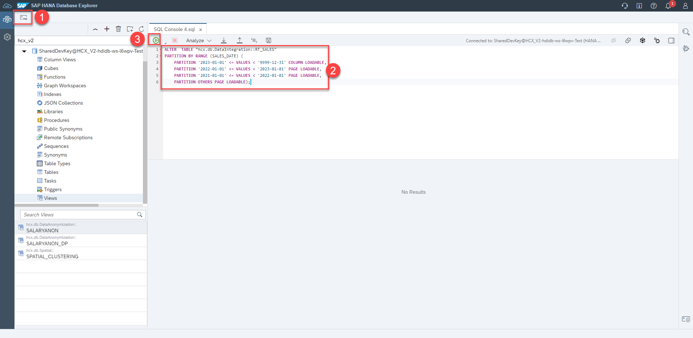
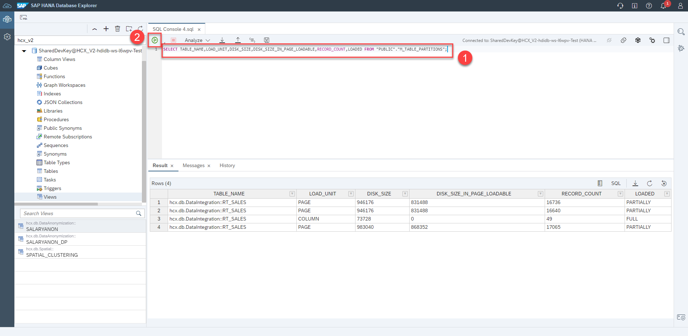
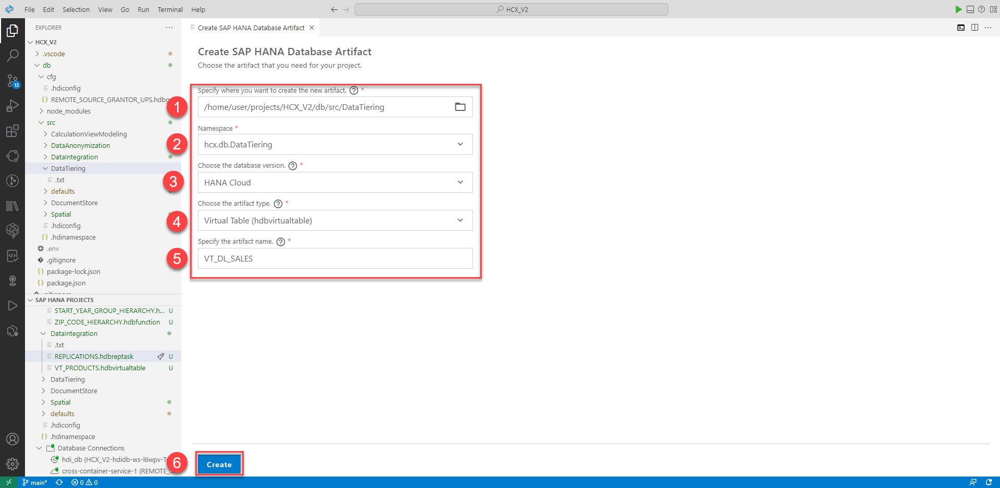
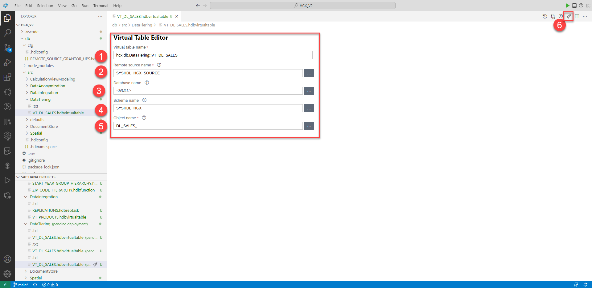
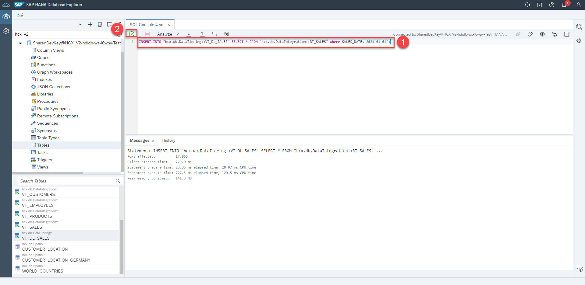
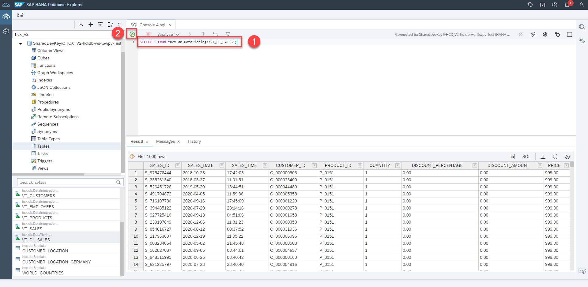
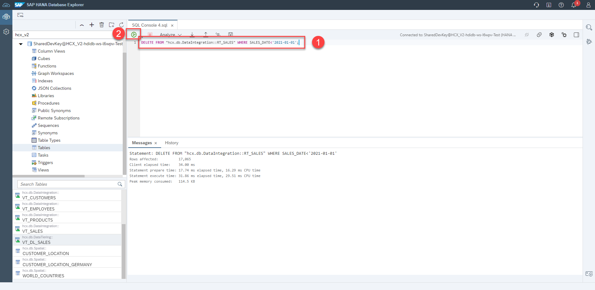
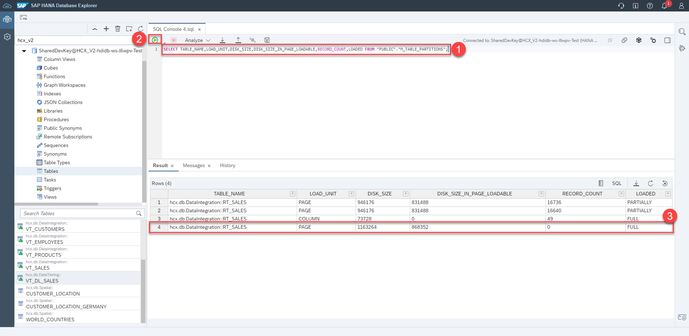
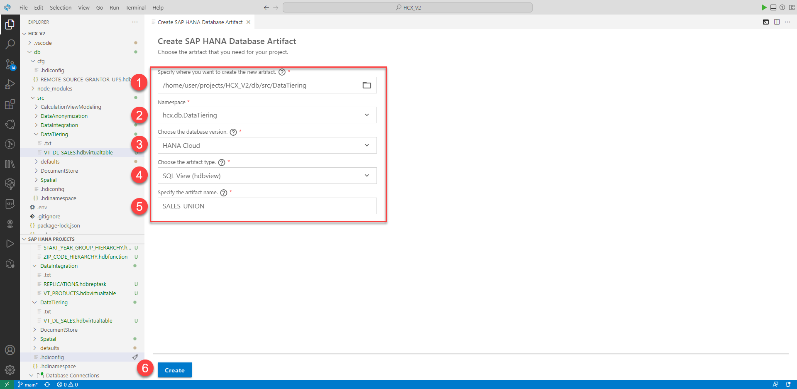
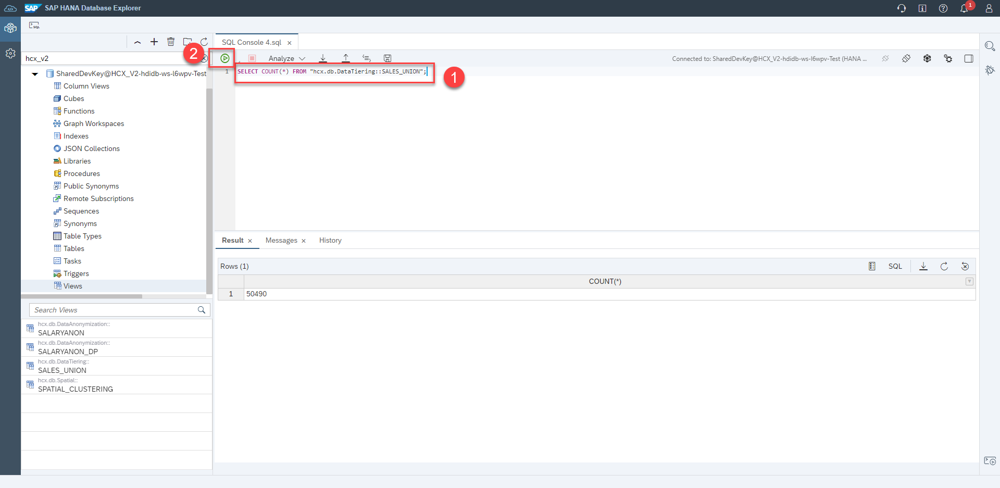

# Data Tiering (optional)

## Table of contents 

- [Data Tiering (optional)](#data-tiering-optional)
  - [Table of contents](#table-of-contents)
  - [Add Partitions to the Sales table](#add-partitions-to-the-sales-table)
  - [Create Data Lake table](#create-data-lake-table)
  - [Insert data into Data Lake table](#insert-data-into-data-lake-table)

## Add Partitions to the Sales table

1. 1. Start in the Database Explorer and open a SQL console.
   2. Paste the following code into the console and run it.

```sql
ALTER  TABLE "hcx.db.DataIntegration::RT_SALES"
PARTITION BY RANGE (SALES_DATE) (
	PARTITION '2023-01-01' <= VALUES < '9999-12-31' COLUMN LOADABLE,
	PARTITION '2022-01-01' <= VALUES < '2023-01-01' PAGE LOADABLE,
	PARTITION '2021-01-01' <= VALUES < '2022-01-01' PAGE LOADABLE,
	PARTITION OTHERS PAGE LOADABLE);
```



2. Run the following statement. As you can see 4 partitions were created and the column loadable partition is completely stored in memory while the 3 page loadable partitions are partially stored in memory, so mostly in NSE.

```sql
SELECT TABLE_NAME,LOAD_UNIT,DISK_SIZE,DISK_SIZE_IN_PAGE_LOADABLE,RECORD_COUNT,LOADED FROM "PUBLIC"."M_TABLE_PARTITIONS";
```



## Create Data Lake table

1. Insert the following code into the SQL console. Please replace **<YOUR_USER_ID>** with your SAP ID. You create a table with the same structure as the sales table in the data lake using the following statement. This will allow us to swap data to it

```sql
CALL SYSHDL_HCX.REMOTE_EXECUTE('CREATE TABLE DL_SALES_<YOUR_USER_ID> ("SALES_ID" VARCHAR(11) NOT NULL,
	"SALES_DATE" DATE NOT NULL,
	"SALES_TIME" TIME,
	"CUSTOMER_ID" VARCHAR(11),
	"PRODUCT_ID" VARCHAR(11),
	"QUANTITY" INTEGER,
	"DISCOUNT_PERCENTAGE" DECIMAL(10, 2),
	"DISCOUNT_AMOUNT" DECIMAL(10, 2),
	"PRICE" DECIMAL(10, 2),
	PRIMARY KEY(
		"SALES_ID", SALES_DATE
	)
)');
```


2. Switch back to BAS.
   1) Click on **View** in the Menu Bar
   2) Then click on **Command Palette...**


3. Type in `SAP HANA: Create HANA Database Artifact` and select this option


4. 1) Change the path to the **DataTiering*** folder, by clicking the folder icon
   2) Click on **..** to navigate to a higher level


5. Click on **DataTiering** and confirm with **OK**


6. Create SAP HANA Database Artifact wizard:
   1) **Path**: `/home/user/projects/HCX_V2/db/src/DataTiering`
   2) **Namespace**: `hcx.db.DataTiering` (should be automatically filled)
   3) **Database Version**: `HANA Cloud`
   4) **Artifact type**: `Virtual Table (hdbvirtualtable)`
   5) **Name**: `VT_DL_SALES`
   6) Click **Create**



7. Click on **Auto-fix**.
   Virtual Table Editor wizard: (You can use the three dots to get suggestions, make sure to replace **<YOUR_USER_ID>** with your SAP ID)
   1) **Virtual table name**: `hcx.db.DataTiering::VT_DL_SALES`
   2) **Remoute source name**: `SYSHDL_HCX_SOURCE`
   3) **Database name**: `<NULL>`
   4) **Schema name**: `SYSHDL_HCX`
   5) **Object name**: `DL_SALES_<YOUR_USER_ID>`



## Insert data into Data Lake table

1. Swtich back to Database Explorer and run the following statement. This inserts all data from the years 2020 and older into the Data Lake table.

```sql
INSERT INTO "hcx.db.DataTiering::VT_DL_SALES" SELECT * FROM "hcx.db.DataIntegration::RT_SALES" WHERE SALES_DATE<'2021-01-01';
```



2. Query the virtual table pointing to the Data Lake table to make sure that the data is outsourced

```sql
SELECT * FROM "hcx.db.DataTiering::VT_DL_SALES";
```



3. Now that the data is outsourced, we can delete it from the database table. Run the following statement.

```sql
DELETE FROM "hcx.db.DataIntegration::RT_SALES" WHERE SALES_DATE<'2021-01-01';
```


<!-- 
4. If we now display the effective partitions of the database table again, we see that the others partition no longer contains any data.

```sql
SELECT TABLE_NAME,LOAD_UNIT,DISK_SIZE,DISK_SIZE_IN_PAGE_LOADABLE,RECORD_COUNT,LOADED FROM "PUBLIC"."M_TABLE_PARTITIONS";
```


-->

4. But if we want to work with all data again, we now create a view that links these two tables via a UNION. Switch back to BAS and create
   1) Click on **View** in the Menu Bar
   2) Then click on **Command Palette...**


5. Type in `SAP HANA: Create HANA Database Artifact` and select this option


6. Create SAP HANA Database Artifact wizard:
   1) **Path**: `/home/user/projects/HCX_V2/db/src/DataTiering`
   2) **Namespace**: `hcx.db.DataTiering` (should be automatically filled)
   3) **Database Version**: `HANA Cloud`
   4) **Artifact type**: `SQL View (hdbview)`
   5) **Name**: `SALES_UNION`
   6) Click **Create**



7. Paste the following code and deploy it.

```sql
VIEW "hcx.db.DataTiering::SALES_UNION" AS
SELECT *
FROM "hcx.db.DataIntegration::RT_SALES"
UNION
SELECT *
FROM "hcx.db.DataTiering::VT_DL_SALES";
```


8. Switch back to Database Explorer and make sure that all data is available again via the view you just created. Run the following statement.

```sql
SELECT COUNT(*) FROM "hcx.db.DataTiering::SALES_UNION";
```



< [Back to Overview](README.md)

<!-- 
## Exercise
- Use table created in Data Integration (with Date compoenent, eg Transaction Date and Status closed,open,new,in Progress)
- DBX
- First Partition the table with Dynamic Aging and filter if Status closed
  - This year+all not closed Hot
  - Last 2-3 year+closed Warm
  - Last 4-10 year+closed in RDL
  - older than 10 years+closed in DLF
  - check open metadata/data
- CALL SYSHDL_HCX.REMOTE_EXECUTE(CREATE Table like)
- insert/delete from HC Table CALL REMOTEEXECUTE
- Virtual Table in .hdbvirtualtable
  - Scheduled job to export to data lake 
- insert into virtual table with newer date to create new partition
- Create View that is combining all if needed with Table for input of the years so not all is fetched (maybe in default from Data Integration which gets updated if needed)
- evtl View mit beiden Daten auch in Calc View nutzen?!

> Q4 planned integration of HDI and Data Lake

< [Back to Overview](README.md)


SELECT * FROM "hcx.db.DataIntegration::RT_SALES";
SELECT COUNT(*) FROM "hcx.db.DataIntegration::RT_SALES";
SELECT YEAR("SALES_DATE"),COUNT(*) FROM  "hcx.db.DataIntegration::RT_SALES" GROUP BY YEAR("SALES_DATE") ORDER BY YEAR("SALES_DATE") DESC; 


ALTER  TABLE "hcx.db.DataIntegration::RT_SALES"
PARTITION BY RANGE (SALES_DATE) (
	PARTITION '2023-01-01' <= VALUES < '9999-12-31' COLUMN LOADABLE,
	PARTITION '2022-01-01' <= VALUES < '2023-01-01' PAGE LOADABLE,
	PARTITION '2021-01-01' <= VALUES < '2022-01-01' PAGE LOADABLE,
	PARTITION OTHERS PAGE LOADABLE);

select * from "PUBLIC"."M_TABLE_PARTITIONS";

CALL SYSHDL_HCX.REMOTE_EXECUTE('CREATE TABLE DL_SALES_<YOUR_USER_ID> ("SALES_ID" VARCHAR(11) NOT NULL,
	"SALES_DATE" DATE NOT NULL,
	"SALES_TIME" TIME,
	"CUSTOMER_ID" VARCHAR(11),
	"PRODUCT_ID" VARCHAR(11),
	"QUANTITY" INTEGER,
	"DISCOUNT_PERCENTAGE" DECIMAL(10, 2),
	"DISCOUNT_AMOUNT" DECIMAL(10, 2),
	"PRICE" DECIMAL(10, 2),
	PRIMARY KEY(
		"SALES_ID", SALES_DATE
	)
)');

create virtual table

insert into "HCX_V2_HDI_DB_2"."hcx.db.DataTiering::trest" select * from SALESNOTNULL where SALES_DATE<'2021-01-01'
delete from SALESNOTNULL where SALES_DATE<'2021-01-01'

create view test as select * from SALESNOTNULL union select * from "HCX_V2_HDI_DB_2"."hcx.db.DataTiering::trest"

select count(*) from test


alter table "hcx.db.DataIntegration::RT_SALES" alter column SALES_DATE date not null)

select * from TABLE_PARTITIONS;
select * from M_TABLE_PARTITIONS;
select * from M_TABLE_PARTITION_STATISTICS;

THIS YEAR IN MEMORY
LAST 2-3 YEARS NSE
4+ RDL


CREATE COLUMN TABLE SALESNOTNULL(
	"SALES_ID" NVARCHAR(11) NOT NULL,
	"SALES_DATE" DATE NOT NULL,
	"SALES_TIME" TIME,
	"CUSTOMER_ID" NVARCHAR(11),
	"PRODUCT_ID" NVARCHAR(11),
	"QUANTITY" INTEGER,
	"DISCOUNT_PERCENTAGE" DECIMAL(10, 2),
	"DISCOUNT_AMOUNT" DECIMAL(10, 2),
	"PRICE" DECIMAL(10, 2),
	PRIMARY KEY(
		"SALES_ID", SALES_DATE
	)
)
UNLOAD PRIORITY 5 AUTO MERGE;
insert into "HCX_V2_HDI_DB_2"."SALESNOTNULL" select * from "HCX_V2_HDI_DB_2"."hcx.db.DataIntegration::RT_SALES"
drop table "HCX_V2_HDI_DB_2"."SALESNOTNULL"


select * from "PUBLIC"."M_TABLE_PARTITIONS"
-->