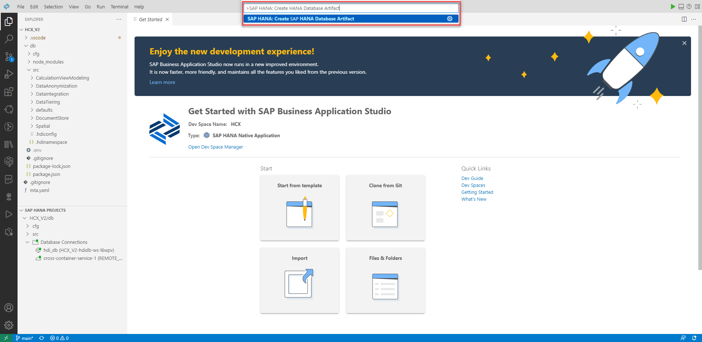
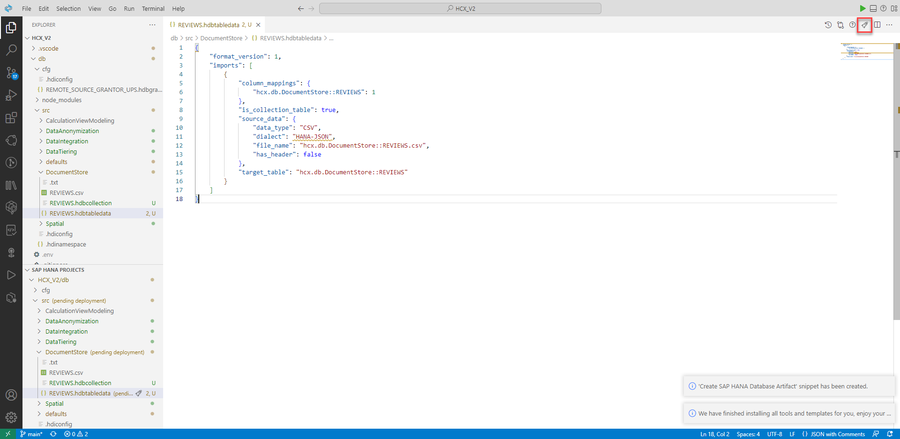

# Document Store (optional)

## Table of contents 

- [Document Store (optional)](#document-store-optional)
  - [Table of contents](#table-of-contents)
  - [Create Collection](#create-collection)
  - [Prereq folder](#prereq-folder)
  - [Exercise](#exercise)
  - [Create Collection](#create-collection-1)
  - [Query the Document Store](#query-the-document-store)

## Create Collection
1. Switch back to BAS.
   1) Click on **View** in the Menu Bar
   2) Then click on **Command Palette...**


3. Type in `SAP HANA: Create HANA Database Artifact` and select this option



4. 1) Change the path to the **DocumentStore*** folder, by clicking the folder icon
   2) Click on **..** to navigate to a higher level


5. Click on **DocumentStore** and confirm with **OK**


6. Create SAP HANA Database Artifact wizard:
   1) **Path**: `/home/user/projects/HCX_V2/db/src/DocumentStore`
   2) **Namespace**: `hcx.db.DocumentStore` (should be automatically filled)
   3) **Database Version**: `HANA Cloud`
   4) **Artifact type**: `Virtual Table (hdbvirtualtable)`
   5) **Name**: `VT_DL_SALES`
   6) Click **Create**


## Prereq folder
- .csv with linebreaks and json input data or Import data?

## Exercise

- Create Collection
- Create tabledata
- Open DBX
- Select * from (Json result)
- select * from where (Json result)
- select Projection and aggregation
- Insert entry
- Update same entry
- Delete same entry
- Combine with Relational data
- renaming columns
- schemaless and schema
- (Arrays)

## Create Collection

1. Switch back to BAS.
   1) Click on **View** in the Menu Bar
   2) Then click on **Command Palette...**


3. Type in `SAP HANA: Create HANA Database Artifact` and select this option


4. 1) Change the path to the **DocumentStore*** folder, by clicking the folder icon
   2) Click on **..** to navigate to a higher level


5. Click on **DocumentStore** and confirm with **OK**


6. Create SAP HANA Database Artifact wizard:
   1) **Path**: `/home/user/projects/HCX_V2/db/src/DocumentStore`
   2) **Namespace**: `hcx.db.DocumentStore` (should be automatically filled)
   3) **Database Version**: `HANA Cloud`
   4) **Artifact type**: `Document Store Collection (hdbcollection)`
   5) **Name**: `REVIEWS`
   6) Click **Create**


7. Should look like this. Then click deploy.

```sql
COLLECTION "hcx.db.DocumentStore::REVIEWS"
```


8. 1) Click on **View** in the Menu Bar
   2) Then click on **Command Palette...**


9. Type in `SAP HANA: Create HANA Database Artifact` and select this option


10. Create SAP HANA Database Artifact wizard:
   1) **Path**: `/home/user/projects/HCX_V2/db/src/DocumentStore`
   2) **Namespace**: `hcx.db.DocumentStore` (should be automatically filled)
   3) **Database Version**: `HANA Cloud`
   4) **Artifact type**: `TableData (hdbtabledata)`
   5) **Name**: `REVIEWS`
   6) Click **Create**


11. Paste the following code and deploy

```json
{
    "format_version": 1,
    "imports": [
        {
            "column_mappings": {
                "hcx.db.DocumentStore::REVIEWS": 1
            },
            "is_collection_table": true,
            "source_data": {
                "data_type": "CSV",
                "dialect": "HANA-JSON",
                "file_name": "hcx.db.DocumentStore::REVIEWS.csv",
                "has_header": false
            },
            "target_table": "hcx.db.DocumentStore::REVIEWS"
        }
    ]
}
```



## Query the Document Store

1. Switch to Database Explorer
   1. Select the catalog object **JSON Collections**
   2. Right-click on **REVIEWS**
   3. Click on **Genereate SELECT Statement**
   4. Run the provided statement


2. Add a filter clause by running the provided statement. As you can see the result is in a json string

```sql
SELECT * FROM "hcx.db.DocumentStore::REVIEWS" WHERE REVIEW_ID='R_00012';
```


3. If we select the columns explicitly the result is in a relational format

```sql
SELECT REVIEW_ID,CUSTOMER_ID,PRODUCT_ID,REVIEW_RATING,REVIEW_TEXT FROM "hcx.db.DocumentStore::REVIEWS" WHERE REVIEW_ID='R_00012';
```


4. You can insert new JSON Objects to the collection.

```sql
INSERT INTO "hcx.db.DocumentStore::REVIEWS" VALUES('{"REVIEW_ID":"R_100123","CUSTOMER_ID":"C_000000205","PRODUCT_ID":"P_0046","REVIEW_RATING":5,"REVIEW_TEXT":"Absolutly perfect"}');
```


5. Query the collection to look for the new entry.

```sql
SELECT * FROM "hcx.db.DocumentStore::REVIEWS" WHERE REVIEW_ID='R_100123';
```


6. Update the inserted entry.

```sql
UPDATE "hcx.db.DocumentStore::REVIEWS" SET REVIEW_TEXT='Hello again' WHERE REVIEW_ID='R_100123';
SELECT * FROM "hcx.db.DocumentStore::REVIEWS" WHERE REVIEW_ID='R_100123';
```

7. Aggregate the JSON Objects

```sql
SELECT PRODUCT_ID,AVG(TO_BIGINT(REVIEW_RATING)) FROM "hcx.db.DocumentStore::REVIEWS" GROUP BY PRODUCT_ID ORDER BY PRODUCT_ID ASC;
```


8. Combine with relational data
```sql
WITH myView AS (SELECT PRODUCT_ID as PID,AVG(TO_BIGINT(REVIEW_RATING)) as AVGRATING FROM "hcx.db.DocumentStore::REVIEWS" GROUP BY PRODUCT_ID )
       SELECT PID,PRODUCT_NAME,AVGRATING FROM myView INNER JOIN "hcx.db.DataIntegration::VT_PRODUCTS"
       ON myView.PID = PRODUCT_ID;
```


<!-- Nested, Arrays -->

< [Back to Overview](README.md)