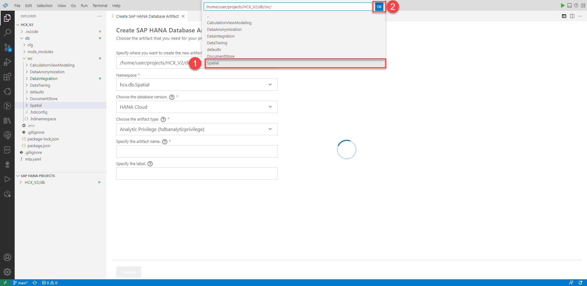
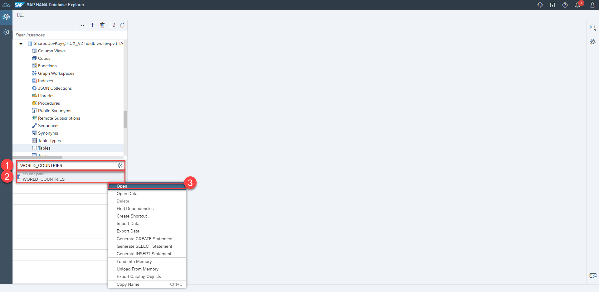
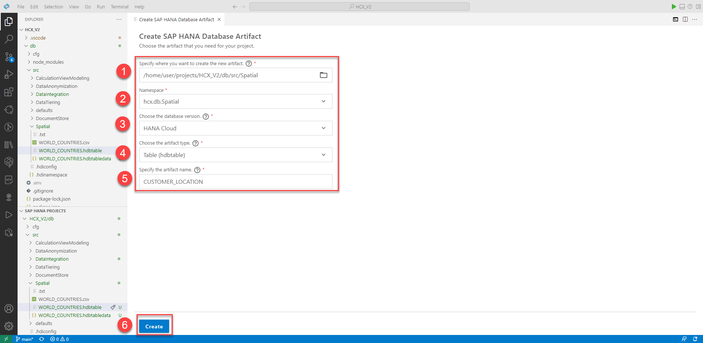

# Spatial (optional)

## Table of contents 

- [Spatial (optional)](#spatial-optional)
  - [Table of contents](#table-of-contents)
  - [Create a table with all countries of the world and their shapes](#create-a-table-with-all-countries-of-the-world-and-their-shapes)
  - [Viewing the State map](#viewing-the-state-map)
  - [Viewing customers on the map](#viewing-customers-on-the-map)
  - [Creating and filling a new Table](#creating-and-filling-a-new-table)
  - [Viewing all customers on the map](#viewing-all-customers-on-the-map)
  - [Separating customers addresses to a specific area](#separating-customers-addresses-to-a-specific-area)
  - [Cluster the customer address](#cluster-the-customer-address)
  - [Evaluation of the results](#evaluation-of-the-results)

<!-- 
## Load a map with German federal states

> In this section, a world map with countries as a table is loaded into the SAP HANA Cloud Database in the form of a shapefile stored locally on the computer.

1. Right-Click on Catalog and Click Import Catalog Objects. 
2. Click on Browse…, select World_Countries.tar.gz in your Windows Explorer and click on Import
-->

## Create a table with all countries of the world and their shapes

> In this section, a world map with countries as a table is loaded into the SAP HANA Cloud Database. The data is already provided by us in the /Spatial/WORLD_COUNTRIES.csv file

1) 1) Click on **View** in the Menu Bar
   1) Then click on **Command Palette...**


2) Type in `SAP HANA: Create HANA Database Artifact` and select this option


3) Change the path to the **Spatial** folder, by clicking the folder icon


4) Click on **..** to navigate to a higher level


5) Click on **Spatial** and confirm with **OK**



6) Create SAP HANA Database Artifact wizard: 
   1) **Path**: `/home/user/projects/HCX_V2/db/src/Spatial`
   2) **Namespace**: `hcx.db.Spatial` (should be automatically filled)
   3) **Database Version**: `HANA Cloud`
   4) **Artifact type**: `Table (hdbtable)`
   5) **Name**: `WORLD_COUNTRIES`
   6) Click **Create**


7) Paste the following code snippet into the file and click on deploy.

```sql
COLUMN TABLE "hcx.db.Spatial::WORLD_COUNTRIES" (
  "FID" INTEGER,
  "COUNTRY" NVARCHAR(40),
  "ISO" NVARCHAR(2),
  "COUNTRYAFF" NVARCHAR(38),
  "AFF_ISO" NVARCHAR(2),
  "SHAPE_Leng" DECIMAL(24, 15),
  "SHAPE_Area" DECIMAL(24, 15),
  "SHAPE" ST_GEOMETRY(1000004326) INTERNAL LAYOUT PLAIN SPATIAL INDEX PREFERENCE DEFAULT VALIDATION BASIC BOUNDARY CHECK OFF
)
```


8) 1) Click on **View** in the Menu Bar
   2) Then click on **Command Palette...**


9) Type in `SAP HANA: Create HANA Database Artifact` and select this option


10) Create SAP HANA Database Artifact wizard: 
   1) **Path**: `/home/user/projects/HCX_V2/db/src/Spatial`
   2) **Namespace**: `hcx.db.Spatial` (should be automatically filled)
   3) **Database Version**: `HANA Cloud`
   4) **Artifact type**: `Table Data (hdbtabledata)`
   5) **Name**: `WORLD_COUNTRIES`
   6) Click **Create**


11) Paste the following code snippet into the file and click on deploy.

```sql
{
    "format_version": 1,
    "imports": [
        {
            "target_table": "hcx.db.Spatial::WORLD_COUNTRIES",
            "source_data": {
                "data_type": "CSV",
                "file_name": "hcx.db.Spatial::WORLD_COUNTRIES.csv",
                "has_header": true,
                "type_config": {
                    "delimiter": ","
                }
            },
            "import_settings": {
                "import_columns": [
                    "FID",
                    "COUNTRY",
                    "ISO",
                    "COUNTRYAFF",
                    "AFF_ISO",
                    "SHAPE_Leng",
                    "SHAPE_Area",
                    "SHAPE"
                ],
                "include_filter": []
            }
        }
    ]
}
```


## Viewing the State map

> In this section, we want to take a look at the country borders of Germany that we uploaded in the previous step using the "WORLD_COUNTRIES" table.

1. Switch to the SAP HANA Database Explorer. Left-Click on Tables and search for ``WORLD_COUNTRIES``. Then right-click on **WORLD_COUNTRIES** and then click **Open**.



2. Click on Open Data


3. Scroll down to Germany and double-click on the SHAPE entry


4. The map will appear:


## Viewing customers on the map

> In this section, we want to display all customers. To do this, we will execute a database query and consider the points individually.

1. Click on the SQL-console-icon:


2. Type in and click on run:

```sql
SELECT *
FROM "hcx.db.DataIntegration::RT_CUSTOMERS";
```


3. As you can see, the addresses already exist in the table as latitude and longitude. These must be processed further to ST_POINT’s. To do this, you must execute the following SQL command with the start-button in the upper left corner:

```sql
SELECT 
	CUSTOMER_ID,
	NEW ST_POINT(
		TO_DOUBLE(CUSTOMER_LONGITUDE), 
		TO_DOUBLE(CUSTOMER_LATITUDE), 
		1000004326
	) AS LOCATION
FROM "hcx.db.DataIntegration::RT_CUSTOMERS";
```


4. Double-click on a **LOCATION** entry. As a result, the map showing the customer location:


## Creating and filling a new Table

> In this section, you create a new table. This should receive the created points of longitude and latitude and the customer IDs. The other information about the customer is not required.

1. Switch back to BAS.

2. 1) Click on **View** in the Menu Bar
   2) Then click on **Command Palette...**


3) Type in `SAP HANA: Create HANA Database Artifact` and select this option


4) Create SAP HANA Database Artifact wizard: 
   1) **Path**: `/home/user/projects/HCX_V2/db/src/Spatial/`
   2) **Namespace**: `hcx.db.Spatial` (should be automatically filled)
   3) **Database Version**: `HANA Cloud`
   4) **Artifact type**: `Table (hdbtable)`
   5) **Name**: `CUSTOMER_LOCATION`
   6) Click **Create**



5. Insert the following code and deploy

```sql
COLUMN TABLE "hcx.db.Spatial::CUSTOMER_LOCATION" (
  CUSTOMER_ID NVARCHAR(11) NOT NULL PRIMARY KEY,
  CUSTOMER_LOCATION ST_Point(1000004326)
)
```


6. Switch back to Database Explorer and execute the following SQL command to insert the values in the new table:
```sql
INSERT INTO "hcx.db.Spatial::CUSTOMER_LOCATION"(CUSTOMER_ID, CUSTOMER_LOCATION)
	SELECT 
	CUSTOMER_ID,
	NEW ST_POINT(
		TO_DOUBLE(CUSTOMER_LONGITUDE), 
		TO_DOUBLE(CUSTOMER_LATITUDE), 
		1000004326
	)
FROM "hcx.db.DataIntegration::RT_CUSTOMERS";
```


## Viewing all customers on the map

> In this section, we will look at all customers locations as collection.

1. To display all customers locations. All points must be combined to a collection. Execute following command for this
```sql
SELECT ST_CollectAggr(CUSTOMER_LOCATION) 
FROM "hcx.db.Spatial::CUSTOMER_LOCATION";
```


2. Double-click on the result


## Separating customers addresses to a specific area

> For our use case, we only need the customers in Germany. Using the polygon from World_Countries, we can check which points are within these borders. To simplify further processing, we store these customers in a second table.

1. Execute the following command to get only the points that are in Germany:

```sql
SELECT 
	CUSTOMER_LOCATION,
	"SHAPE".ST_Contains(CUSTOMER_LOCATION) AS "In Germany"
FROM 
	"hcx.db.Spatial::CUSTOMER_LOCATION",
	"hcx.db.Spatial::WORLD_COUNTRIES"
WHERE "COUNTRY" = 'Germany'
	AND "SHAPE".ST_Contains(CUSTOMER_LOCATION) = 1;
```


2. Switch back to BAS.

3. 1) Click on **View** in the Menu Bar
   2) Then click on **Command Palette...**


4) Type in `SAP HANA: Create HANA Database Artifact` and select this option


5) Create SAP HANA Database Artifact wizard: 
   1) **Path**: `/home/user/projects/HCX_V2/db/src/Spatial/`
   2) **Namespace**: `hcx.db.Spatial` (should be automatically filled)
   3) **Database Version**: `HANA Cloud`
   4) **Artifact type**: `Table (hdbtable)`
   5) **Name**: `CUSTOMER_LOCATION_GERMANY`
   6) Click **Create**


6. Insert the following code and deploy to create a table for customers in Germany:

```sql
COLUMN TABLE "hcx.db.Spatial::CUSTOMER_LOCATION_GERMANY" (
  CUSTOMER_ID NVARCHAR(11) NOT NULL PRIMARY KEY,
  CUSTOMER_LOCATION ST_Point(1000004326)
)
```


7. Switch back to Database Explorer. Execute the following command to insert the customers in Germany:
```sql
INSERT INTO "hcx.db.Spatial::CUSTOMER_LOCATION_GERMANY"(CUSTOMER_ID, CUSTOMER_LOCATION)
	SELECT 
	CUSTOMER_ID,
	CUSTOMER_LOCATION
FROM 
	"hcx.db.Spatial::CUSTOMER_LOCATION",
	"hcx.db.Spatial::WORLD_COUNTRIES"
WHERE "COUNTRY" = 'Germany'
	AND "SHAPE".ST_Contains(CUSTOMER_LOCATION) = 1;
```


8. Execute the following command to receive all customers in Germany as a collection 

```sql
SELECT ST_CollectAggr(CUSTOMER_LOCATION)
FROM "hcx.db.Spatial::CUSTOMER_LOCATION_GERMANY";
```


9. Double-click on the result:


10. Execute the following command to receive all customers in Germany as a collection bordered by the German border

```sql
SELECT "SHAPE".ST_Collect(ST_CollectAggr(CUSTOMER_LOCATION))
FROM "hcx.db.Spatial::CUSTOMER_LOCATION_GERMANY",
"hcx.db.Spatial::WORLD_COUNTRIES"
WHERE "COUNTRY" = 'Germany';
```


11. Double-click on the result:


## Cluster the customer address

> In this section, we are clustering all customers locations in Germany.

1. Switch back to BAS.

2. 1) Click on **View** in the Menu Bar
   1) Then click on **Command Palette...**


4) Type in `SAP HANA: Create HANA Database Artifact` and select this option


5) Create SAP HANA Database Artifact wizard: 
   1) **Path**: `/home/user/projects/HCX_V2/db/src/Spatial/`
   2) **Namespace**: `hcx.db.Spatial` (should be automatically filled)
   3) **Database Version**: `HANA Cloud`
   4) **Artifact type**: `SQL View (hdbview)`
   5) **Name**: `SPATIAL_CLUSTERING`
   6) Click **Create**


3. Insert the following code and deploy

```sql
VIEW "hcx.db.Spatial::SPATIAL_CLUSTERING" AS
SELECT ST_ClusterID() AS ID,
  ST_ClusterCell() AS SHAPE,
  ST_ClusterCell().ST_PointOnSurface().ST_AsText() AS POINT,
  COUNT(*) AS COUNT
FROM "hcx.db.Spatial::CUSTOMER_LOCATION_GERMANY" GROUP CLUSTER BY "CUSTOMER_LOCATION" USING HEXAGON X CELLS 20
ORDER BY COUNT DESC;
```


## Evaluation of the results

> In this section, we will look at the cluster result from different views.

1. Switch back to Database Explorer 
   1. Click on **Views**
   2. Right-click on **SPATIAL_CLUSTERING**
   3. Click on **Open Data**


2. Let's look at the largest hexagon with 200 entries by double-clicking the **SHAPE** entry. We can see that Frankfurt has the closeness customer density:


<!-- 
---
> todo
---

3. It’s interesting to know where all locations are in the Hexagon. You can do this by executing the following commands and double-click on the result:
```sql
SELECT 
ST_CollectAggr(Kunde.CUSTOMER_LOCATION).ST_Collect(ST_ClusterCell())
FROM COMPANY_DEMO.CUSTOMER_LOCATION_Germany AS Kunde
GROUP CLUSTER BY "CUSTOMER_LOCATION"
USING HEXAGON X CELLS 20
HAVING COUNT(*) = 200;
```
1. What is the general distribution of the hexagons over Germany? Execute the following command:
```sql
WITH clustered_data AS (
	SELECT ST_ClusterCell() as SHAPE
	FROM COMPANY_DEMO.CUSTOMER_LOCATION_Germany 
	GROUP CLUSTER BY "CUSTOMER_LOCATION"
	USING HEXAGON X CELLS 20
	ORDER BY COUNT(*) DESC
)	
SELECT ST_CollectAggr(SHAPE)
FROM clustered_data;
```
-->

< [Back to Overview](README.md)